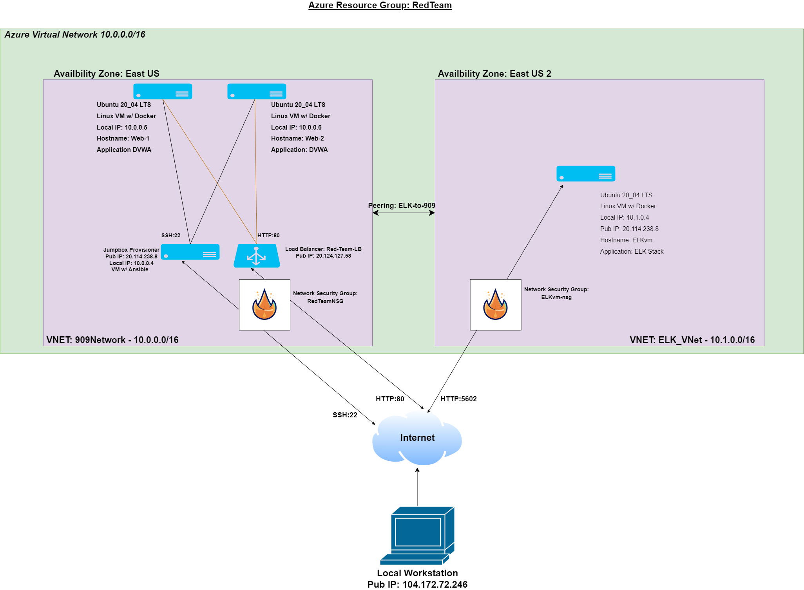

# week13
## Automated ELK Stack Deployment

The files in this repository were used to configure the network depicted below.

These files have been tested and used to generate a live ELK deployment on Azure. They can be used to either recreate the entire deployment pictured above. Alternatively, select portions of the yml file may be used to install only certain pieces of it, such as Filebeat.

  - [Elk Playbook](Ansible/elk-playbook.yml)

This document contains the following details:
- Description of the Topology
- Access Policies
- ELK Configuration
  - Beats in Use
  - Machines Being Monitored
- How to Use the Ansible Build

### Description of the Topology

The main purpose of this network is to expose a load-balanced and monitored instance of DVWA, the Damn Vulnerable Web Application.

Load balancing ensures that the application will be highly availible, in addition to restricting access direct to the network. Futhermore, the load balancers ensure avaliblity of services by distributing network traffic across the server behind it. It will help minimize the affects DDoS attacks. The jumpbox acts as a gateway to the configuration environment. It provides a single location of configuration files and other resources used to deploy the elk stack.

Integrating an ELK server allows users to easily monitor the vulnerable VMs for changes to the data and system logs. Filebeat will monitor the changes to the files on the server and metricbeat will provide information about system resources and performance. 

The configuration details of each machine may be found below.

| Name     | Function  | IP Address | Operating System     |
|----------|-----------|------------|----------------------|
| Jump Box | Gateway   | 10.0.0.4   | Linux (ubuntu 20.04) |
| Web-1    | Webserver | 10.0.0.5   | Linux (ubuntu 20.04) |
| Web-2    | Webserver | 10.0.0.6   | Linux (ubuntu 20.04) |
| ELKvm    | LogServer | 10.1.0.4   | Linux (ubuntu 20.04) |

### Access Policies

The machines on the internal network are not exposed to the public Internet. 

Only the jumpbox machine can accept connections from the Internet. Access to this machine is only allowed from the following IP addresses:
- 104.172.72.246 on port 22

Machines within the network can only be accessed by the jumpbox.
- The Jumpbox has access to the Web-1 and Web-2 VMs via port 22.
- PC with public IP of 104.172.72.246 on port 5602 can access the ELKvm with a web browser. 

A summary of the access policies in place can be found in the table below.

| Name     | Publicly Accessible | Allowed IP Addresses |
|----------|---------------------|----------------------|
| Jump Box | Yes                 | 104.172.72.246:22    |
| Web-1    | No                  | 10.0.0.4:22          |
| Web-2    | No                  | 10.0.0.4:22          |
| ELKvm    | Yes                 | 104.172.72.246:5601  |

### Elk Configuration

Ansible was used to automate configuration of the ELK machine. No configuration was performed manually, which is advantageous because configuration as code allows for easy deployment and re-deployment with the same configurations reducing human error. It makes it easy to create identical machines.

The playbook implements the following tasks:
- Install docker, pip3, docker python module
- Increased VM memory allocation
- Downloads then installs Elk container
- Maps port 5601 to 5601 and 9200 to 9200.

The following screenshot displays the result of running `docker ps` after successfully configuring the ELK instance.

(Images/docker_ps.png)

### Target Machines & Beats
This ELK server is configured to monitor the following machines:
- Web-1 - 10.0.0.5
- Web-2 - 10.0.0.6

We have installed the following Beats on these machines:
- Filebeat version 7.4.0
- Metricbeat version 7.4.0

These Beats allow us to collect the following information from each machine:
- Filebeat collects the log files or locations that you specify, collects log events, and forwards them either to Elasticsearch or Logstash for indexing.
- Metricbeat collects system-level CPU usage, memory, file system, disk IO, and network IO statistics, as well as top-like statistics for every process running on your systems.

### Using the Playbook
In order to use the playbook, you will need to have an Ansible control node already configured. Assuming you have such a control node provisioned: 

SSH into the control node and follow the steps below:
- Copy the filebeat-config.yml to /etc/ansible/files/filebeat-config.yml.
- Update the filebeat-config.yml file to include:
  - username and password
  - host IP and port number
- Run the playbook, and navigate to http://20.114.238.8:5601/ to check that the installation worked as expected.
- Filename filebeat-playbook.yml is the playbook. Copy it to /etc/ansible/roles
- Update the hosts file to indicate which machine to install the ELK server on.
- Navigate to http://20.114.238.8:5601/ in order to check that the ELK server is running.
